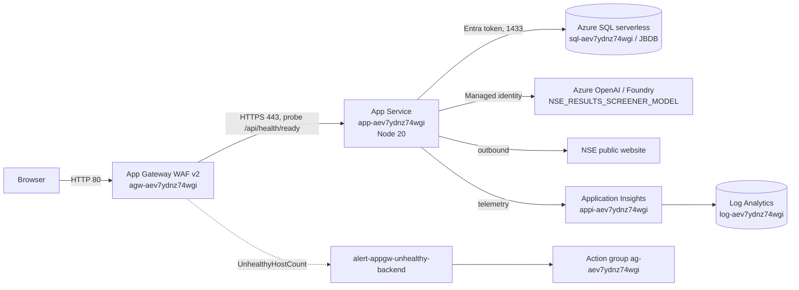
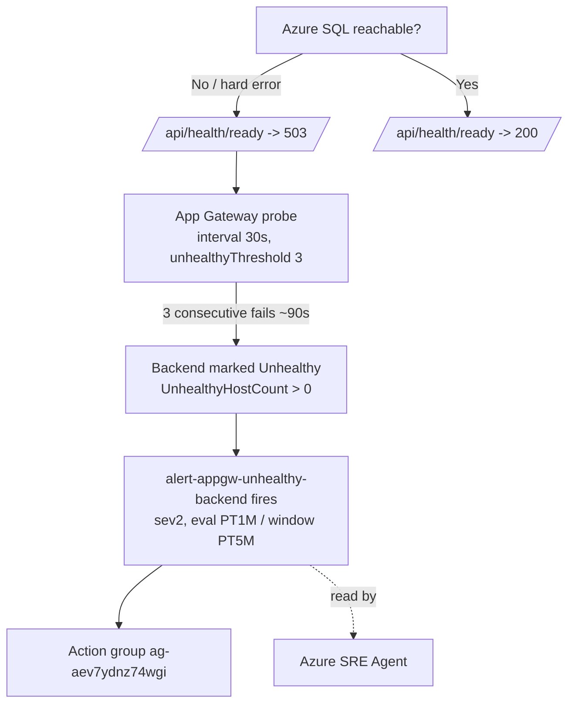

# NSE Results Screener — Architecture

> Internal architecture reference for operators and the Azure SRE Agent.
> Use this document to understand component responsibilities, dependencies,
> data flow, and the signals each component emits during an incident.

## 1. Overview

The NSE Results Screener ("Indian Earnings Intelligence") is a single-origin web
application that scrapes Indian (NSE) quarterly earnings filings, scores/analyzes
them (with an LLM), and serves a React dashboard plus a JSON API from one Node.js
process.

It is deployed as an **App Service "secure baseline"**: the App Service is private
to a VNet and only reachable through an **Application Gateway (WAF v2)**. Data lives
in **Azure SQL (serverless)**, LLM calls go to an **Azure OpenAI / Foundry** resource,
and all telemetry flows to **Application Insights + Log Analytics**.

- **Subscription:** `ME-MngEnvMCAP083130-vijanak-1` (`da4c3e1b-2de5-450b-99be-4c6400c2abdf`)
- **Tenant:** `2c8f1bd2-1a0c-4c4b-b232-626d6141f334`
- **Region:** `westus2`
- **Resource group:** `RG_JB_NSE_RESULTS_SCREENER`
- **Resource token (name suffix):** `aev7ydnz74wgi`
- **Public entry point (use the FQDN, not the IP — the WAF blocks numeric Host headers):**
  `http://nse-aev7ydnz74wgi.westus2.cloudapp.azure.com` (gateway public IP `20.3.118.43`)

## 2. Component inventory

| Component | Azure resource | Notes |
|---|---|---|
| Application Gateway (WAF v2) | `agw-aev7ydnz74wgi` | OWASP 3.2, **Prevention** mode. Public ingress. |
| Public IP | `pip-aev7ydnz74wgi` | Static, DNS label `nse-aev7ydnz74wgi`. |
| WAF policy | `waf-aev7ydnz74wgi` | OWASP 3.2, max body 128 KB, file upload 100 MB. |
| Virtual network | `vnet-aev7ydnz74wgi` | `10.0.0.0/16`. |
| — App Gateway subnet | `snet-appgw` | `10.0.1.0/24`, service endpoint `Microsoft.Web`. |
| — App subnet | `snet-app` | `10.0.2.0/24`, delegated `Microsoft.Web/serverFarms`. |
| App Service plan | `plan-aev7ydnz74wgi` | Linux, **P1v3**. |
| Web app | `app-aev7ydnz74wgi` | Node 20, system-assigned identity, VNet-integrated. |
| Azure SQL server | `sql-aev7ydnz74wgi` | Entra-only auth (no SQL login). |
| Azure SQL database | `JBDB` | `GP_S_Gen5` serverless, auto-pause 60 min, 0.5–2 vCore. |
| Azure OpenAI / Foundry | `nse-results-screener-resource` | Deployment `NSE_RESULTS_SCREENER_MODEL`. Keyless. |
| Log Analytics | `log-aev7ydnz74wgi` | 30-day retention. |
| Application Insights | `appi-aev7ydnz74wgi` | appId `02f28f47-f21e-4bff-99ba-c3e9ab993f7a`, workspace-based. |
| Action group | `ag-aev7ydnz74wgi` | short name `nseAlerts`. No receivers (alerts still fire/are visible). |
| Metric alert | `alert-appgw-unhealthy-backend` | Fires on `UnhealthyHostCount > 0`. |

## 3. Topology

### Inbound path
`Internet → Public IP → App Gateway (WAF, port 80) → App Service (HTTPS 443)`.
The App Service **rejects all inbound traffic except from `snet-appgw`**
(`ipSecurityRestrictionsDefaultAction: Deny`, allow rule for the gateway subnet).
Direct hits to `app-aev7ydnz74wgi.azurewebsites.net` return **403 Ip Forbidden** by design.

### Outbound path
The App Service is regional-VNet-integrated via `snet-app` (`vnetRouteAllEnabled: false`,
so only private traffic is forced through the VNet; internet egress — NSE scraping, SMTP,
App Insights ingestion — goes direct). It reaches Azure SQL over the public endpoint
(SQL firewall rule `AllowAllWindowsAzureIps`) using an **Entra access token** from its
managed identity, and Azure OpenAI keylessly via the same identity.

## 4. Identity & access (keyless)

- **Web app system-assigned managed identity** is the single workload identity.
  - **Azure SQL:** Entra-only auth (`azureADOnlyAuthentication: true`); the app's MI is
    granted DB access (db_owner / ddl_admin via `scripts/grant-sql-access.mjs`). The app
    creates and owns its own `jb_`-prefixed schema.
  - **Azure OpenAI:** the `ai-access` module grants the MI the OpenAI user role on
    `nse-results-screener-resource`.
- **No secrets, connection strings, or API keys** are stored in the app. Auth uses
  `@azure/identity` `DefaultAzureCredential` → Managed Identity in Azure.
  (Locally, the developer's `az login` / Entra identity is used and a SQL firewall rule
  for the dev IP is required.)

## 5. Application runtime

- **Process:** single Node.js 20 / Express app (`server.js`), ESM (`"type":"module"`),
  started with `node server.js`, port `8080` in App Service (`PORT` env), `3001` locally.
- **Frontend:** Vite/React in `earnings-intelligence/`, built to `dist/` and served as
  static files by the same Express process (one origin for UI + API).
- **Telemetry bootstrap:** `src/telemetry.js` is imported **first** (before express/mssql/
  axios) so the Application Insights SDK can auto-instrument. Cloud role `nse-screener-api`.
- **Background work:**
  - Auto-refresh **cron `*/10 * * * *`** runs the scan pipeline (also keeps the serverless
    DB warm, so auto-pause — min 60 min — effectively never triggers in steady state).
  - **AI model health monitor** every 60s (`/api/ai-health`).
  - On startup, `purgeStaleFilings()` removes belated/backlog filings before the first scan.

### Key configuration (App Service app settings)

| Setting | Value | Purpose |
|---|---|---|
| `DB_BACKEND` | `azure-sql` | Selects Azure SQL repository. |
| `DATA_MODE` | `live` | Scrape NSE (vs `mock`/`auto`). |
| `AZURE_SQL_SERVER` | `sql-aev7ydnz74wgi.database.windows.net` | DB host. |
| `AZURE_SQL_DATABASE` | `JBDB` | DB name. |
| `AZURE_OPENAI_ENDPOINT` | `https://nse-results-screener-resource.services.ai.azure.com` | LLM endpoint. |
| `AZURE_OPENAI_DEPLOYMENT` | `NSE_RESULTS_SCREENER_MODEL` | Model deployment. |
| `AI_READ_PDF` | `true` | Parse result PDFs with the LLM. |
| `FILING_MAX_REPORTING_LAG_DAYS` | `90` | Staleness filter (drop filings whose broadcast lags the period end by more than N days). |
| `APPLICATIONINSIGHTS_CONNECTION_STRING` | (set) | App Insights ingestion. |

## 6. HTTP surface

| Endpoint | DB-dependent? | Behavior |
|---|---|---|
| `GET /api/health` | No | **Liveness.** Always `{"ok":true}` 200. Never touches SQL. |
| `GET /api/health/ready` | Yes | **Readiness.** 200 when DB connected; **503** when DB is in `error` (or stuck `connecting` > 90s grace). This is the **App Gateway probe target**. |
| `GET /api/meta` | Yes | dbStatus, aiHealth, companiesProcessed. |
| `GET /api/results`, `/api/result/:ticker`, `/api/sectors`, `/api/stats`, `/api/alerts`, `/api/movers`, `/api/leaderboard`, `/api/watchlist` | Yes | Data endpoints; return **503** ("Data store unavailable") when SQL is down. |
| `GET /api/ai-health` | No | Last cached AI model probe result. |
| `GET /api/live` | Partial | Server-Sent Events stream (status/data pushes). |

All DB-backed routes are wrapped by `wrap()` in `server.js`, which on failure calls
`trackError(...)` (App Insights) and returns **503** with a JSON error body.

## 7. Health & alerting chain (how an outage becomes a signal)

- A **brief serverless resume** reports `connecting`; the readiness endpoint returns 200
  for up to a 90s grace window, so normal resumes do **not** flap the backend.
- A **hard failure** (public-access disabled, login/token failure, stuck connecting)
  returns 503 persistently → backend Unhealthy → alert fires → SRE Agent is triggered and
  can correlate with App Insights evidence.
- The alert has `autoMitigate: true`, so it clears automatically once the backend is Healthy.

> **Historical note / known blind spot (fixed):** the probe previously targeted
> `/api/health` (liveness), which returns 200 without touching SQL. During a DB outage the
> backend stayed "Healthy", the alert never fired, and its history stayed empty. The probe
> now targets `/api/health/ready` so DB outages surface as the alert.

## 8. Observability

- **Application Insights** `appi-aev7ydnz74wgi` (workspace-based; data also queryable in
  Log Analytics `log-aev7ydnz74wgi`). Captures:
  - `requests` (incl. failed 5xx), `dependencies` (SQL, HTTP, AAD token), `exceptions`
    (e.g. `ConnectionError`), `traces` (console logs incl. `[azure-sql] connect attempt …`).
- **Noise to ignore:** `CredentialUnavailableError` / `EnvironmentCredential` exceptions are
  the normal `DefaultAzureCredential` chain falling through to managed identity.
- **CLI gotcha:** `az monitor app-insights query ... -o table` with `summarize ... by` can
  render an **empty** table even when rows exist. Always use
  `-o json --query "tables[0].rows"`.

## 9. Dependencies & failure modes (summary)

| Dependency | If it fails | User-visible symptom | Signal |
|---|---|---|---|
| Azure SQL | DB outage / paused / access denied | Dashboard data empty; 503 on data endpoints | `/api/health/ready` 503 → backend Unhealthy → alert; App Insights `ConnectionError` + failed requests |
| Azure OpenAI | Model unreachable / throttled | AI insights missing; `/api/ai-health` degraded | App Insights failed dependency to `*.services.ai.azure.com`; AI health banner |
| NSE website | Scrape fails | Stale data, no new filings | Trace logs in scan; no new rows |
| App Gateway / WAF | Misconfig or WAF block | 403 / 502 at the gateway | App Gateway metrics/logs |

## 10. Source layout (for code-level investigation)

| Path | Responsibility |
|---|---|
| `server.js` | Express app, routes, SSE, static frontend, health endpoints, telemetry wiring. |
| `src/telemetry.js` | Application Insights bootstrap + `trackError` / `flushTelemetry`. |
| `src/config.js` | `.env` loader + central config (incl. `filingMaxReportingLagDays`). |
| `src/db.js` | Repository dispatcher + `getDbStatus()` (azure-sql / sqlite / memory). |
| `src/azuresql.js` | Azure SQL pool, Entra token auth, backoff, status, queries. |
| `src/pipeline.js` | Scan pipeline + `purgeStaleFilings()`. |
| `src/scraper.js` | NSE acquisition + staleness guard. |
| `src/quarters.js` | Quarter indexing + `quarterIndexToPeriodEnd()`. |
| `src/scoring.js`, `src/ai.js`, `src/pdf.js`, `src/nse.js` | Scoring, LLM, PDF parsing, NSE helpers. |
| `infra/` | Bicep (subscription-scoped `main.bicep` + modules) deployed via `azd`. |
| `scripts/grant-sql-access.mjs` | Grants the app MI access to Azure SQL (use this; the `.ps1`/`.sh` variants are unreliable). |

## 11. Deploy / operate

- **Code only:** `azd deploy --no-prompt`
- **Infra only:** `azd provision`
- **Both:** `azd up`
- **Grant SQL access to the app MI:** `node ./scripts/grant-sql-access.mjs`

> Deploy ordering caveat: the App Gateway probe targets `/api/health/ready`. When changing
> health-endpoint behavior, **deploy app code before** repointing the probe, otherwise the
> probe could 404 and wrongly mark the backend Unhealthy.
